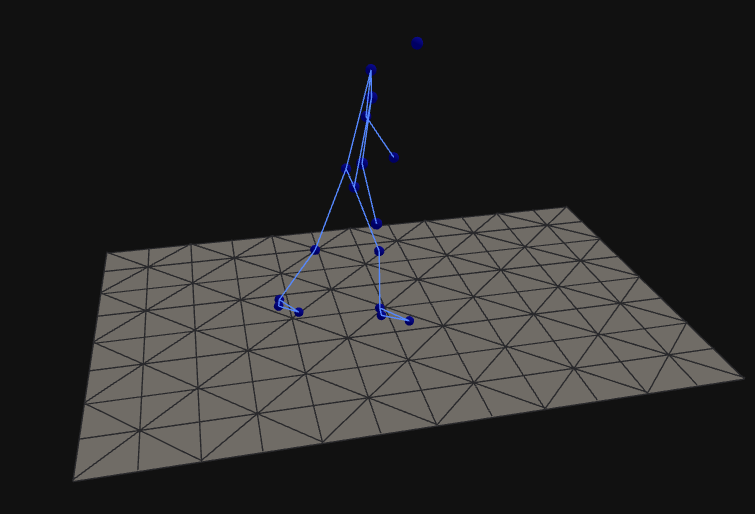

# Sensfloor Pose Viewer
This Frontend is build to visualize the outputs from here https://github.com/sensfloor/sensfloor-pipeline

It can visualize any JSON Poses sent via websocket in the format of [this](./public/sample_data.js)

Additionally, Multiple CSV Files can be streamed to compare poses

More configurations can be found [here](./src/config.js)

# Prerequisites
To be able to run this app you will need `npm` (reccommended at least version 9.6.7)

# Starting the app
Run the following commands in the Root repository

`npm install`  
`npm run dev`

You should be prompted to open http://localhost:5173/ to see the app